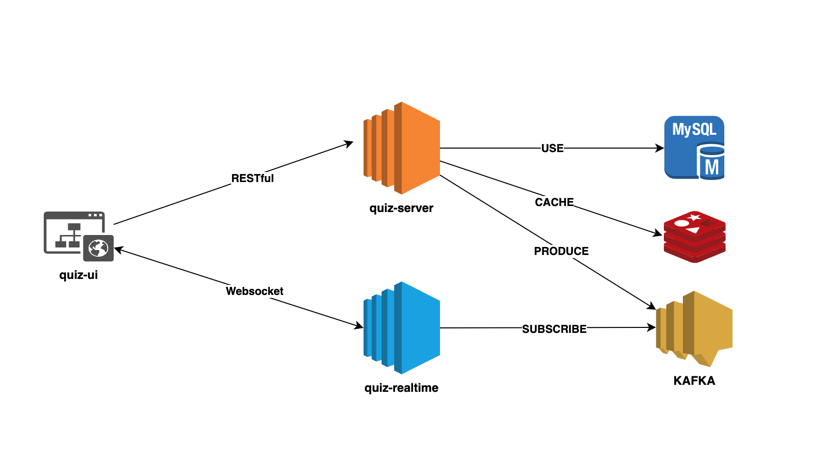

# High-Level Architecture of Quiz Application

## Overview

This document provides a high-level overview of the architecture of a real-time quiz application that integrates various 
technologies, including Spring Boot, Node.js, MySQL, Redis, and Kafka. 
The architecture is designed to handle real-time interactions, user sessions, and efficient data management.

## Architecture Components

### 1. **Frontend (React)**
- **Technology**: React
- **Responsibilities**:
    - User interface for signing in, displaying quiz questions, and showing real-time updates.
    - Handles user input and interactions, managing state locally.

### 2. **Backend Services**
- **Technology**:
    - **Spring Boot**: Handles business logic and RESTful API endpoints for quiz management.
    - **Node.js**: Manages WebSocket connections for real-time communication.

#### a. **Spring Boot Service**
- **Responsibilities**:
    - Manages quiz data and user sessions.
    - Interacts with the MySQL database for persistent storage of quiz-related data.
    - Provides REST APIs for frontend to access and manage quiz sessions.

#### b. **Node.js Service**
- **Responsibilities**:
    - Manages real-time events using WebSockets.
    - Subscribes to Kafka topics for real-time message processing.
    - Sends updates to connected clients based on Kafka messages.

### 3. **Database**
- **Technology**: MySQL
- **Responsibilities**:
    - Stores persistent data related to questions, options.
    - Supports relational queries to retrieve and manipulate data efficiently.

### 4. **Caching Layer**
- **Technology**: Redis
- **Responsibilities**:
    - Caches frequently accessed data, such as quiz states and participant information, to enhance performance.
    - Stores temporary data for active quizzes and their participants.

### 5. **Message Broker**
- **Technology**: Kafka
- **Responsibilities**:
    - Facilitates asynchronous communication between services.
    - Handles real-time events and notifications related to quiz activities (e.g., quiz started, leader board changed).
    - Ensures reliable message delivery and scalability.
