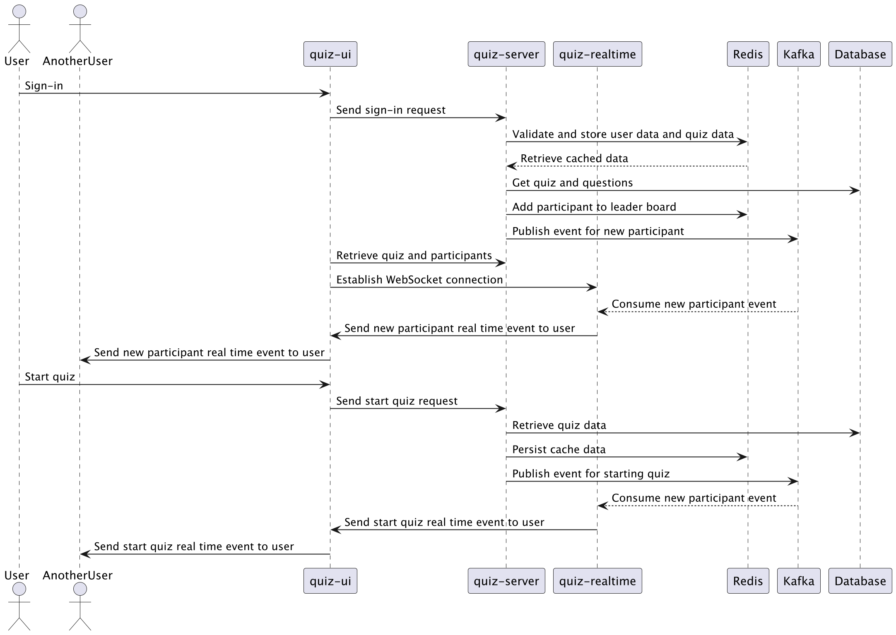
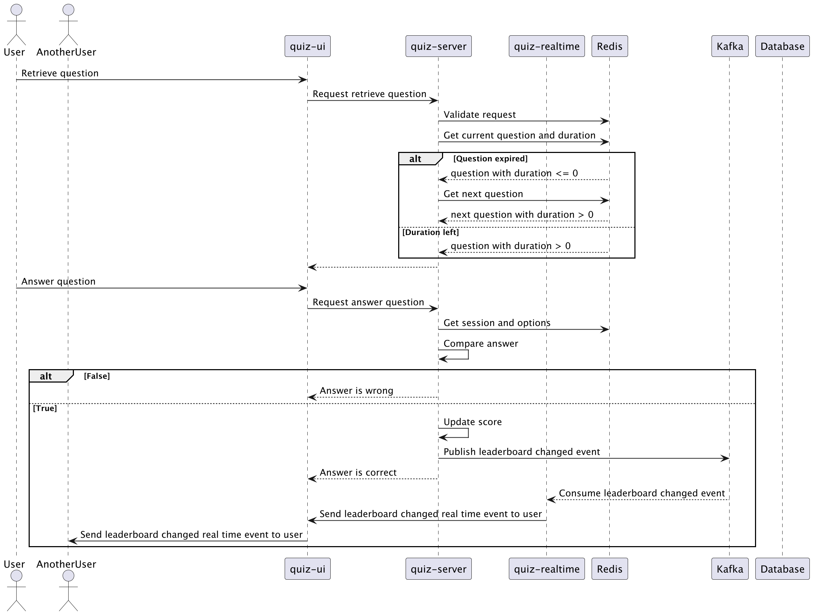

# Flow of Data

1. **User Interaction**: Users interact with the React frontend to sign in and join a quiz session.
2. **Sign-In Process**:
    - The frontend sends a sign-in request to the Spring Boot service.
    - The Spring Boot service validates the request, manages the user session, and stores relevant data in MySQL.
    - After user action, Spring Boot service will publish appropriate realtime action to Kafka
3. **Real-Time Communication**:
    - Once signed in, users establish a WebSocket connection to the Node.js service.
    - The Node.js service listens for messages and updates from Kafka.
4. **Kafka Events**:
    - When an event (e.g., quiz started) occurs, it is published to a Kafka topic.
    - The Node.js service consumes the event and sends updates to all connected clients.
5. **Data Management**:
    - Persistent data is stored in MySQL, while frequently accessed data is cached in Redis for quick retrieval.
    - The Spring Boot service interacts with both MySQL and Redis as needed.

### Sign-in

### Leaderboard

